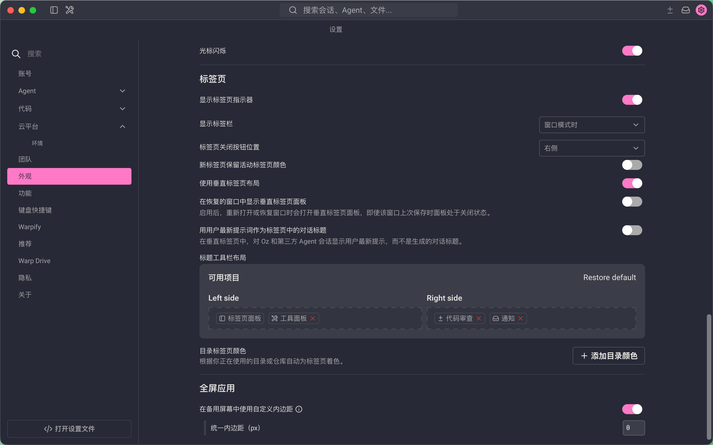

# Warp CN

Warp CN 是基于 [Warp](https://github.com/warpdotdev/warp) 开源客户端维护的个人自用简体中文汉化版。它的目标很明确：在 Warp 官方尚未提供完整中文界面之前，提供一个可以在本地构建、日常使用、继续跟随上游更新的中文版本。

> [!IMPORTANT]
> 本仓库不是 Warp 官方发行版，也不代表 Warp 官方中文版本。Warp 的账号体系、云服务、协议、商标、上游功能和许可证仍以 Warp 官方项目为准。

## 当前状态

当前版本：`0.20.5`

当前结论：个人使用目标下的汉化版已经完成。项目已经完成源码级简体中文 overlay、核心界面覆盖、基础构建验证和当前周期 GUI 冒烟检查，可以作为本地中文 Warp fork 使用。`0.20.5` 进一步规范了免费路线 macOS Apple Silicon DMG 打包流程，使用 `release-lto` 构建、完整 bundled UI 资源、正确版本元数据和 ad-hoc 签名。

本项目不以“官方中文版本”“公开 RC”或“可代表 Warp 官方发布”为目标。仓库中保留的 public-RC 证据脚本和 blocker registry 只是未来如果要做更高保证公开发布时的辅助材料，不影响当前个人使用版完成状态。

## 快速下载体验

当前提供 macOS Apple Silicon（arm64）个人体验包：

- 下载：[Warp-CN-0.20.5-macos-arm64-release.dmg](https://github.com/Drew1811266/Warp-CN/releases/latest/download/Warp-CN-0.20.5-macos-arm64-release.dmg)
- SHA256：`332fad238be467a8b786dac84f3329425a1fe2ff5046d80ae862f0d9fe8d52f0`

下载后打开 DMG，将 `WarpOss.app` 拖入 `Applications`，然后在 Finder 中右键选择“打开”。这个体验包是 ad-hoc 签名的 release 构建，没有经过 Apple Developer ID 签名和公证；如果 macOS 拦截，可以在确认来源后用以下命令移除下载隔离标记：

```bash
xattr -dr com.apple.quarantine /Applications/WarpOss.app
open -n /Applications/WarpOss.app
```

## 系统要求

本项目的 macOS 要求与 Warp 官方要求保持一致：macOS 10.14 或更高版本，并且硬件支持 Metal。当前发布的体验包只提供 Apple Silicon（arm64）构建；Apple Silicon Mac 的实际系统范围是 macOS 11 Big Sur 或更高版本。

## 界面预览

以下截图来自本仓库源码构建的隔离本地 profile，不包含真实账号、密钥或历史会话数据。

| 启动界面 | 设置界面 |
| --- | --- |
|  |  |

## 汉化范围

当前汉化覆盖了日常使用中最常见的 Warp 界面和大量低频路径，包括：

- 首次启动、登录入口、认证提示和基础 onboarding。
- 工作区、shell 输入、tab、tab config、搜索入口、命令搜索和常见菜单。
- 设置页核心区域，包括外观、AI、BYO API Key、AWS Bedrock、自定义推理 endpoint 等文案。
- 常见弹窗、toast、计划、额度、credit、删除、转让和危险确认相关文案。
- Agent 提示、Agent 状态、错误提示、会话详情、scheduled task、web search、fetch、get-files 等文案。
- Warp Drive、共享会话、终端分享、终端通知、rewind、terminal block、view、ambient、zero-state 等终端相关表面。

少量英文会被有意保留，例如产品名、命令语法、配置 key、协议字段、内部标识符、测试 fixture、日志哨兵或不适合翻译的技术术语。保留这些内容是为了避免破坏功能或造成误导。

## 技术方式

Warp CN 当前采用源码级 overlay，而不是运行时语言包。翻译条目集中维护在 TOML manifest 中，再由脚本精确应用到源码字符串。

核心文件：

| 文件 | 用途 |
| --- | --- |
| `resources/localization/zh-Hans-overrides.toml` | 简体中文翻译清单 |
| `resources/localization/zh-Hans-inventory-ignore.toml` | 不应翻译的字符串忽略规则 |
| `resources/localization/zh-Hans-glossary.toml` | 术语表、保留词和禁用译法 |
| `script/zh_apply_localization.py` | 应用、校验和统计翻译清单 |
| `script/zh_localization_inventory.py` | 扫描候选英文字符串和覆盖率 |
| `script/zh_export_locale.py` | 导出 JSON/YAML locale 雏形，方便未来迁移 |
| `script/privacy_guard.py` | 检查截图、录屏、账号、token 等敏感产物 |

`zh_apply_localization.py` 是幂等的：源码还是英文时会替换为中文；源码已经是中文时会视为已应用；如果英文原文和中文目标都找不到，会报告上游字符串可能已经漂移。

## 获取项目

本仓库包含 Git LFS 文件：

```bash
git clone https://github.com/Drew1811266/Warp-CN.git
cd Warp-CN
git lfs install
git lfs pull
```

建议先启用本地隐私防护 hooks：

```bash
sh script/install_privacy_hooks.sh
```

## 构建和运行

安装依赖并运行：

```bash
./script/bootstrap --skip-common-skills
./script/run
```

非交互式构建 bundle：

```bash
TERM=xterm-256color WARP_SKIP_COMMON_SKILLS_INSTALL=1 ./script/run --dont-open
open -n target/debug/bundle/osx/WarpOss.app
```

生成免费路线 macOS Apple Silicon DMG：

```bash
python3 script/zh_low_load_gate.py --probes 1 --wait-seconds 10 --max-load 12 --max-hot-process-percent 250
script/macos/package_oss_free --version 0.20.5
```

这个脚本会生成 `release-lto` 构建、补齐 app bundle 资源和版本元数据、执行 ad-hoc 签名，并输出 `target/Warp-CN-<version>-macos-arm64-release.dmg`。它不需要 Apple Developer Program，也不会执行 Developer ID 签名或 Apple 公证。

> [!NOTE]
> 当前 app crate 的 package 名称是 `warp`，因此请使用 `cargo check -p warp`。旧文档里的 `cargo check -p app` 不适用于当前 workspace。

## 校验汉化状态

日常检查可以运行：

```bash
python3 script/privacy_guard.py --all-tracked
python3 script/zh_apply_localization.py --validate-manifest
python3 script/zh_apply_localization.py --check-glossary
python3 script/zh_apply_localization.py --metadata-summary
python3 script/zh_apply_localization.py --dry-run --summary
python3 -m unittest discover -s script -p 'test_zh_*.py'
git diff --check
```

检查核心界面覆盖率：

```bash
python3 script/zh_localization_inventory.py --preset onboarding --coverage
python3 script/zh_localization_inventory.py --preset workspace --coverage
python3 script/zh_localization_inventory.py --preset search --coverage
python3 script/zh_localization_inventory.py --preset settings --coverage
python3 script/zh_localization_inventory.py --preset modals --coverage
python3 script/zh_localization_inventory.py --preset release --coverage
```

如需做 Rust 层面的重型验证：

```bash
CARGO_BUILD_JOBS=1 cargo check -j 1 -p warp
TERM=xterm-256color WARP_SKIP_COMMON_SKILLS_INSTALL=1 ./script/run --dont-open
```

如果机器负载较高，可以先运行可选散热保护检查：

```bash
python3 script/zh_low_load_gate.py --probes 2 --wait-seconds 60 --max-load 2.50 --max-hot-process-percent 25
```

## 更新翻译

重新应用翻译：

```bash
python3 script/zh_apply_localization.py
cargo fmt
```

查看候选字符串：

```bash
python3 script/zh_localization_inventory.py --preset workspace --status candidate
python3 script/zh_localization_inventory.py --preset settings --status candidate
python3 script/zh_localization_inventory.py --preset modals --top-paths 20
```

新增翻译条目时，优先使用 manifest v2 元数据：

```toml
[[replace]]
key = "workspace.example.open"
path = "app/src/example.rs"
source = "Open"
target = "打开"
context = "Example toolbar action"
status = "active"
preserve_terms = ["Warp"]
expected_count = 1
```

不要翻译命令语法、协议字段、配置 key、遥测事件名、测试字符串和内部日志，除非确认它们是用户可见 UI。

## 项目维护

常用维护入口：

- `docs/zh-Hans-development-guide.md`：汉化维护、审计、验证、GUI 检查和上游同步的主手册。
- `docs/zh-Hans-release-notes-0.20.md`：0.20 自定义汉化版说明。
- `docs/zh-Hans-upstream-sync.md`：同步上游 Warp stable 的流程。
- `docs/zh-Hans-review-checklist.md`：翻译质量和模块审查清单。
- `docs/zh-Hans-functional-risk-register.md`：高风险字符串处理规则。
- `docs/zh-Hans-evidence-policy.md`：截图、录屏和 GUI 证据的隐私处理规则。

同步上游后，推荐先修复 manifest drift，再重新应用 overlay，并用 inventory 检查新增候选英文字符串。中文源码可以再生成，长期需要维护的是翻译清单、术语表、忽略规则和验证脚本。

## 隐私和安全

不要提交真实账号、token、API key、认证回调、私有 endpoint、原始 GUI 录屏、截图证据或本地 agent 计划。当前 `.gitignore` 已排除 `.omx/`、GUI smoke artifact 目录、构建产物和常见本地文件，但提交前仍应运行：

```bash
python3 script/privacy_guard.py --all-tracked
git status -sb --ignored=matching
git diff --cached --check
```

不要用个人主账号验证删除、计费、Cloud、team、managed secret、custom inference endpoint 等危险或外部状态路径。

## 常见问题

### 这是官方中文版本吗？

不是。本项目是个人自用的 Warp 简体中文 fork，不代表 Warp 官方中文版本，也不改变 Warp 官方服务和许可证要求。

### 这个项目算汉化完成了吗？

按个人使用目标，已经完成。当前版本已经覆盖核心界面和常见使用路径，可以本地构建和使用。没有完成的是公开 RC 级别的外部账号、后端 fixture、一次性对象和正式发布证据闭环；这些不属于当前个人使用目标。

### 为什么不是运行时语言包？

因为上游 Warp 当前还没有完整的一方应用语言设置或成熟 UI localization framework。本项目暂时采用源码级 overlay，并保留 JSON/YAML locale 导出能力，方便未来迁移到官方 `zh-CN` 语言资源。

### 为什么还会看到英文？

少量英文是产品名、命令语法、配置 key、协议字段、内部标识符、测试 fixture 或有意保留术语。翻译这些内容可能破坏功能或造成使用混乱。

## 上游项目

- 官方网站：[warp.dev](https://www.warp.dev)
- 上游仓库：[warpdotdev/warp](https://github.com/warpdotdev/warp)
- 官方文档：[docs.warp.dev](https://docs.warp.dev)

## 许可证

本仓库基于 Warp 开源客户端。

- `warpui_core` 和 `warpui` crates 使用 [`LICENSE-MIT`](LICENSE-MIT)。
- 其余代码使用 [`LICENSE-AGPL`](LICENSE-AGPL)。

本地化翻译和维护脚本随本 fork 一并发布，但不改变上游项目原有许可证要求。
