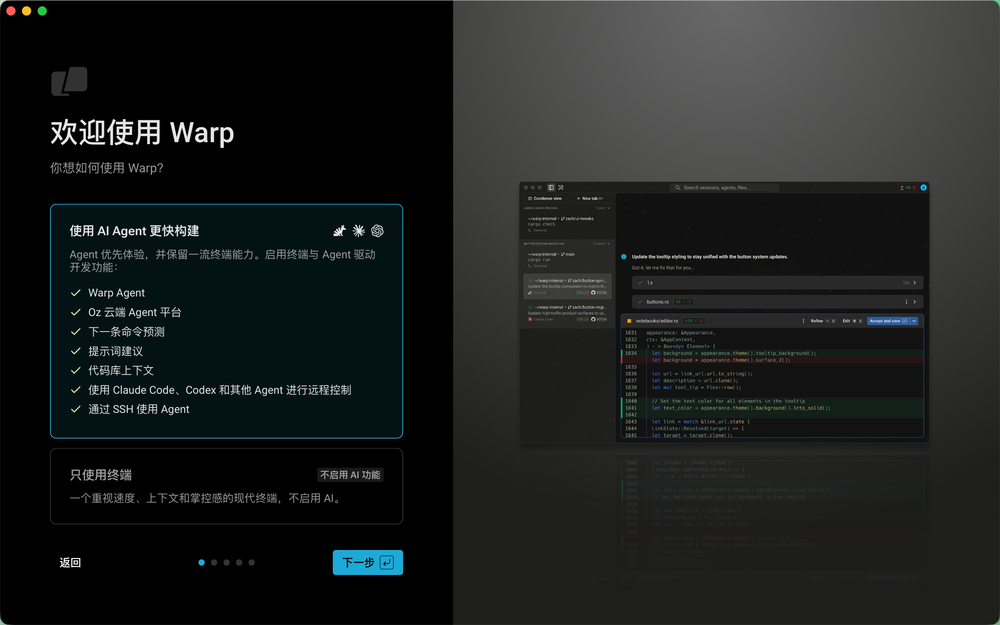
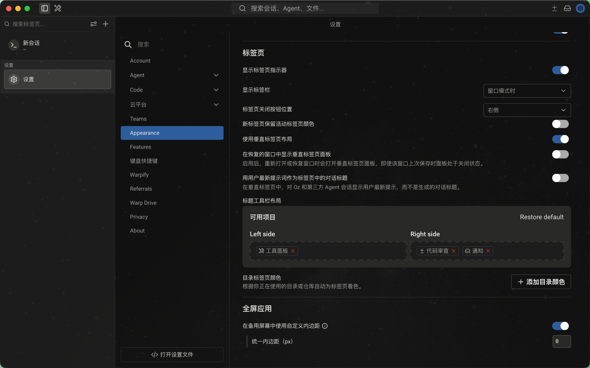

# Warp CN

Warp CN 是基于 [Warp](https://github.com/warpdotdev/warp) 开源客户端维护的简体中文本地化 fork。它的目标是在 Warp 官方尚未提供完整应用语言切换和中文语言包之前，提供一个可以本地构建、可审查、可继续跟随上游的中文版本。

> [!IMPORTANT]
> 本仓库不是 Warp 官方发行版，也不代表 Warp 官方中文版本。上游功能、账号体系、云服务、协议、商标和许可证仍以 Warp 官方项目为准。

## 界面预览

以下截图来自 `0.19` 当前源码构建的隔离本地 profile，不包含真实账号、密钥或历史会话数据。

| 启动界面 | 设置界面 |
| --- | --- |
|  |  |

## 当前状态

当前版本：`0.19`

最后核验记录：`2026-06-04 RC39`

当前结论：`ready-for-source-localization; heavy-gates-deferred`。也就是说，当前 0.19 上游 stable 源码树的汉化 overlay、manifest 漂移修复、候选翻译、脚本测试和全量翻译审计已经完成，但本轮没有把它提升为公开 RC。电脑负载保护 gate 返回 `defer-heavy-gate`，因此额外串行 Rust 编译、bundle refresh 和 GUI launch 证据都已延期。公开 RC 仍需要补齐 GUI、隔离账号、后端 fixture、一次性对象和静态图证据。

## 汉化进度

当前源码级汉化 overlay 已经处于干净状态：

| 指标 | 当前值 |
| --- | ---: |
| Manifest 条目 | 7,937 |
| 覆盖文件 | 550 |
| 已应用条目 | 5,717 |
| 待应用变更 | 0 |
| 丢失或漂移条目 | 0 |
| `context` 元数据覆盖 | 100.0% |
| `status` 元数据覆盖 | 100.0% |
| Public-RC blocker | 11 |

核心 inventory 预设的当前覆盖情况：

| 区域 | 已覆盖 | 候选残留 | 覆盖率 |
| --- | ---: | ---: | ---: |
| Onboarding / Auth | 314 | 0 | 100.0% |
| Workspace | 874 | 0 | 100.0% |
| Search | 267 | 0 | 100.0% |
| Settings | 2,040 | 0 | 100.0% |
| Modals | 5,177 | 0 | 100.0% |
| Release aggregate | 8,534 | 0 | 100.0% |

当前主要风险不再是“大量源码文案未翻译”，而是公开发布前的重型构建、GUI 证据和外部状态验证还没有完成。

## 已覆盖内容

本地化清单已经覆盖高频可见界面和大量低频路径，包括：

- 首次启动、登录入口、认证提示和基础 onboarding。
- 工作区 shell、tab、tab config、搜索入口、命令面板和常见菜单。
- 设置核心页、Appearance、AI 设置、BYO API Key、AWS Bedrock、自定义推理 endpoint 文案。
- 常见弹窗、toast、计划/额度/credit 弹窗、删除和转让等危险确认。
- Agent 提示、Agent 状态和错误残留、会话详情、scheduled task、web search/fetch/get-files 文案。
- Warp Drive、共享会话、终端分享、终端通知、rewind、terminal block/view/ambient/zero-state 等终端相关表面。
- 公开 RC 前置文档、GUI 冒烟矩阵、证据策略、术语表、locale 导出和 public-RC blocker registry。

## 还剩什么

公开 RC 还没有达标，剩余 blocker 由 `resources/localization/zh-Hans-public-rc-blockers.toml` 管理：

| 类型 | 数量 | 说明 |
| --- | ---: | --- |
| `backend_fixture` | 5 | 需要后端或可控 fixture 才能稳定验证 |
| `disposable_object` | 3 | 需要一次性对象来验证删除/取消/危险确认路径 |
| `isolated_account` | 3 | 需要隔离测试账号，不能使用个人主账号冒险验证 |

后续重点：

1. 用隔离账号验证登录、账号状态、Settings、custom inference 等路径。
2. 为 Billing、Cloud、managed secret、team 等外部状态路径补齐 fixture 或可控测试证据。
3. 重新生成或设计确认 onboarding 静态 PNG，当前仍有历史英文静态图残留需要单独资产分支处理。
4. 在电脑负载可控时重新跑 heavy gate、串行 `cargo check -j 1 -p warp`、bundle refresh 和 GUI launch gate；本轮 0.19 适配因低负载 gate 返回 `defer-heavy-gate` 而延期。
5. 继续做逐条翻译审查，重点检查语义、术语一致性、UI 容量和功能安全，而不是盲目增加条目。
6. 对外描述上游状态时使用显式 tag/commit/tree 证据；当前 0.19 适配工作树基于官方上游 `v0.2026.06.03.09.49.stable_00`，commit `2249469e5d24e472cee6ce97d3d324293f67db71`。
7. 等待或推动 Warp 官方 i18n 框架成熟后，把当前 manifest 迁移为官方 `zh-CN` locale。

## 汉化方式

当前采用源码级 overlay。翻译条目集中维护在 TOML manifest 中，再由脚本精确应用到源码字符串。中文源码应视为可再生成的本地构建产物，长期资产是翻译清单、术语表、忽略规则、审查记录和验证流程。

核心文件：

| 文件 | 用途 |
| --- | --- |
| `resources/localization/zh-Hans-overrides.toml` | 简体中文翻译清单 |
| `resources/localization/zh-Hans-inventory-ignore.toml` | inventory 忽略规则 |
| `resources/localization/zh-Hans-glossary.toml` | 术语表、保留词和禁用译法 |
| `resources/localization/zh-Hans-public-rc-blockers.toml` | 公开 RC blocker registry |
| `resources/localization/zh-Hans-public-rc-evidence.toml` | 公开 RC 脱敏证据元数据 ledger |
| `script/zh_apply_localization.py` | 应用、校验和统计翻译清单 |
| `script/zh_localization_inventory.py` | 扫描候选英文字符串和覆盖率 |
| `script/zh_export_locale.py` | 导出 JSON/YAML locale 迁移雏形 |
| `script/zh_public_rc_status.py` | 汇总公开 RC blocker 状态 |
| `script/zh_public_rc_evidence_lint.py` | 校验公开 RC 证据元数据是否逐行匹配且可提交 |
| `script/zh_public_rc_evidence_report.py` | 生成 public-RC 证据分类报表、安全 packet 模板、missing-action 输出、JSON 输出和 row/category Markdown action packet |
| `script/zh_public_rc_evidence_queue.py` | 生成 public-RC 优先级证据队列、JSON 队列和 Markdown 队列 |
| `script/zh_public_rc_evidence_candidate.py` | 预检 public-RC 脱敏候选证据文本，输出 text/JSON/Markdown 审查结果 |
| `script/privacy_guard.py` | 检查截图、录屏、原始 GUI 证据等敏感产物 |

`zh_apply_localization.py` 是幂等的：源码还是英文时会替换为中文；源码已经是中文时会视为已应用；如果英文原文和中文目标都找不到，会报告上游字符串可能已经漂移。

## 快速开始

本仓库包含 Git LFS 文件：

```bash
git clone https://github.com/Drew1811266/Warp-CN.git
cd Warp-CN
git lfs install
git lfs pull
```

建议先启用本地隐私防护 hooks：

```bash
sh script/install_privacy_hooks.sh
```

低负载校验汉化状态：

```bash
python3 script/zh_apply_localization.py --validate-manifest
python3 script/zh_apply_localization.py --check-glossary
python3 script/zh_apply_localization.py --metadata-summary
python3 script/zh_apply_localization.py --dry-run --summary
python3 script/zh_public_rc_status.py
```

重新应用翻译：

```bash
python3 script/zh_apply_localization.py
cargo fmt
```

构建并运行：

```bash
./script/bootstrap --skip-common-skills
./script/run
```

非交互式构建 bundle：

```bash
TERM=xterm-256color WARP_SKIP_COMMON_SKILLS_INSTALL=1 ./script/run --dont-open
open -n target/debug/bundle/osx/WarpOss.app
```

> [!NOTE]
> 当前 app crate 的 package 名称是 `warp`，因此请使用 `cargo check -p warp`。旧文档里的 `cargo check -p app` 不适用于当前 workspace。

## 常用验证

日常 README、清单或脚本改动建议使用低负载验证：

```bash
python3 script/privacy_guard.py --all-tracked
python3 script/zh_apply_localization.py --validate-manifest
python3 script/zh_apply_localization.py --check-glossary
python3 script/zh_apply_localization.py --dry-run --summary
python3 script/zh_public_rc_status.py
python3 -m unittest script/test_zh_apply_localization.py script/test_zh_localization_inventory.py script/test_zh_export_locale.py script/test_zh_public_rc_status.py script/test_zh_low_load_gate.py
cargo fmt --check
git diff --check
```

重型 gate 前先运行散热保护检查：

```bash
python3 script/zh_low_load_gate.py --probes 2 --wait-seconds 60 --max-load 2.50 --max-hot-process-percent 25
```

只有输出 `decision: run-heavy-gate` 时才继续跑 Rust compile、bundle 和 GUI。

发布前再补充重型 gate。为避免本地电脑过热，建议串行、低并发运行：

```bash
CARGO_BUILD_JOBS=1 cargo check -j 1 -p warp
TERM=xterm-256color WARP_SKIP_COMMON_SKILLS_INSTALL=1 ./script/run --dont-open
```

如果改动涉及具体 UI 模块，还需要补充对应模块测试和人工 GUI 冒烟。

## 继续汉化和审查

查看候选字符串：

```bash
python3 script/zh_localization_inventory.py --preset workspace --status candidate
python3 script/zh_localization_inventory.py --preset settings --status candidate
python3 script/zh_localization_inventory.py --preset modals --top-paths 20
```

新增翻译条目时，优先使用 manifest v2 元数据：

```toml
[[replace]]
key = "workspace.example.open"
path = "app/src/example.rs"
source = "Open"
target = "打开"
context = "Example toolbar action"
status = "active"
preserve_terms = ["Warp"]
expected_count = 1
```

不要翻译命令语法、协议字段、配置 key、遥测事件名、测试字符串和内部日志，除非确认它们是用户可见 UI。

## 维护文档

主要文档：

- `docs/zh-Hans-development-guide.md`：汉化开发、审计、验证、GUI 证据、public-RC 和上游同步的主开发手册。
- `docs/zh-Hans-localization.md`：总体维护记录和阶段索引。
- `docs/zh-Hans-release-candidate-2026-06-04-rc39.md`：当前 RC39 记录。
- `docs/zh-Hans-upstream-stable-adaptation-2026-06-04.md`：0.19 上游 stable 适配记录。
- `docs/zh-Hans-release-notes-0.19-draft.md`：0.19 本地化 release notes 草稿。
- `docs/zh-Hans-official-release-next-development-tasks.md`：0.19 后续重型 gate、GUI 证据和公开 RC 任务清单。
- `docs/zh-Hans-release-candidate-2026-06-03-rc38.md`：上一轮 RC38 记录。
- `docs/zh-Hans-release-candidate-2026-06-02-rc37.md`：RC37 记录。
- `docs/zh-Hans-release-candidate-2026-06-02-rc36.md`：RC36 记录。
- `docs/zh-Hans-release-candidate-2026-06-02-rc35.md`：RC35 记录。
- `docs/zh-Hans-release-candidate-2026-06-02-rc34.md`：RC34 记录。
- `docs/zh-Hans-release-candidate-2026-06-02-rc33.md`：RC33 记录。
- `docs/zh-Hans-release-candidate-2026-06-02-rc32.md`：RC32 记录。
- `docs/zh-Hans-release-candidate-2026-06-02-rc31.md`：RC31 记录。
- `docs/zh-Hans-release-candidate-2026-06-02-rc30.md`：RC30 记录。
- `docs/zh-Hans-release-candidate-2026-06-02-rc29.md`：RC29 记录。
- `docs/zh-Hans-release-candidate-2026-06-02-rc28.md`：RC28 记录。
- `docs/zh-Hans-release-candidate-2026-06-02-rc27.md`：RC27 记录。
- `docs/zh-Hans-release-candidate-2026-06-02-rc26.md`：RC26 记录。
- `docs/zh-Hans-release-candidate-2026-06-02-rc25.md`：RC25 记录。
- `docs/zh-Hans-release-candidate-2026-06-02-rc24.md`：RC24 记录。
- `docs/zh-Hans-release-candidate-2026-06-02-rc23.md`：RC23 记录。
- `docs/zh-Hans-release-candidate-2026-06-02-rc22.md`：RC22 记录。
- `docs/zh-Hans-release-candidate-2026-06-02-rc21.md`：RC21 记录。
- `docs/zh-Hans-release-candidate-2026-06-02-rc20.md`：RC20 记录。
- `docs/zh-Hans-public-rc-gate-runbook.md`：公开 RC gate 操作说明。
- `docs/zh-Hans-local-fixture-implementation-plan-rc20.md`：本地 fixture 实施准备计划。
- `docs/zh-Hans-gui-smoke-matrix.md`：GUI 冒烟矩阵和 manual gate。
- `docs/zh-Hans-review-checklist.md`：模块审查和翻译质量检查清单。
- `docs/zh-Hans-full-translation-audit.md`：逐条翻译审查台账。
- `docs/zh-Hans-functional-risk-register.md`：高风险字符串处理规则。
- `docs/zh-Hans-evidence-policy.md`：GUI 证据和隐私产物处理规则。
- `docs/zh-Hans-upstream-sync.md`：同步上游 stable 的流程。

## 敏感信息和证据处理

不要提交真实账号、token、API key、认证回调、私有 endpoint、原始 GUI 录屏、截图证据或本地 agent 计划。当前 `.gitignore` 已排除 `.omx/`、GUI smoke artifact 目录、构建产物和常见本地文件，但提交前仍应运行：

```bash
python3 script/privacy_guard.py --all-tracked
git status -sb --ignored=matching
git diff --cached --check
```

公开验证需要使用隔离测试账号或本地 fixture。不要用个人主账号验证删除、计费、Cloud、team、managed secret、custom inference endpoint 等危险或外部状态路径。

## 常见问题

### 这是完整汉化版吗？

不是官方完整语言包。它是高可见路径和大量低频路径都已覆盖的本地化 fork，但公开 RC 仍缺外部状态和 GUI 证据。

### 为什么还有英文？

少量英文是产品名、命令语法、配置 key、协议字段、内部标识符、测试 fixture 或有意保留术语。翻译这些内容可能破坏功能或造成使用混乱。

### 为什么不是运行时语言包？

因为上游 Warp 当前还没有完整的一方应用语言设置或成熟 UI localization framework。本项目暂时采用源码级 overlay，并保留 JSON/YAML locale 导出能力，方便未来迁移到官方 `zh-CN` 语言资源。

### 能直接公开发布吗？

现在不建议。`0.19 / RC39` 的源码级本地化候选可以继续用于工程验证，但本轮重型构建、bundle refresh 和 GUI launch 已因低负载 gate 延期；公开 RC 仍需要清掉 11 个 blocker，补齐 GUI、账号、后端 fixture、一次性对象和静态图证据，并在用户明确批准后再发布或打 tag。

## 上游项目

- 官方网站：[warp.dev](https://www.warp.dev)
- 上游仓库：[warpdotdev/warp](https://github.com/warpdotdev/warp)
- 官方文档：[docs.warp.dev](https://docs.warp.dev)

## 许可证

本仓库基于 Warp 开源客户端。

- `warpui_core` 和 `warpui` crates 使用 [`LICENSE-MIT`](LICENSE-MIT)。
- 其余代码使用 [`LICENSE-AGPL`](LICENSE-AGPL)。

本地化翻译和维护脚本随本 fork 一并发布，但不改变上游项目原有许可证要求。
